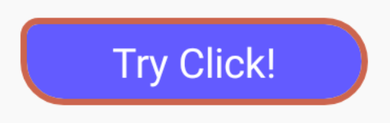
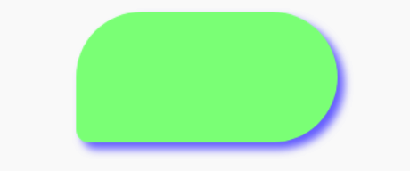

# R2D2RoundCorner

Android round corner layouts and ImageView TextView with shadow

**Step 1. Add the JitPack repository to your root build.gradle:**
```groovy

allprojects {
    repositories {
        maven { url 'https://www.jitpack.io' }
    }
}
```

**Step 2. Add the dependency** [](https://www.jitpack.io/#hzx0910/R2D2RoundCorner)
```groovy

dependencies {
        implementation 'com.github.hzx0910:R2D2RoundCorner:1.0.4'
}
```

**Step 3. Set each corner/shadow in your layout.xml**

|  PREVIEW   | CODE  |
|  ----  | ----  |
|   | &lt;make.more.r2d2.round_corner.RoundText <br /> &nbsp; style="@style/base_button" <br /> &nbsp; android:clickable="true" <br /> &nbsp; android:text="Try Click!" <br /> &nbsp; app:round_bg="@color/stateful" <br /> &nbsp; app:round_radius="15dp" <br /> &nbsp; app:round_radius_top_left="6dp" <br /> &nbsp; app:round_stroke_color="@color/colorAccent" <br /> &nbsp; app:round_stroke_width="2dp" /&gt;|
|   | &lt;make.more.r2d2.round_corner.ShadowFrame <br /> &nbsp; android:layout_width="wrap_content" <br /> &nbsp; android:layout_height="wrap_content" <br /> &nbsp; android:clickable="true" <br /> &nbsp; android:padding="6dp" <br /> &nbsp; app:shadow_color="@color/stateful" <br /> &nbsp; app:shadow_dx="2dp" <br /> &nbsp; app:shadow_dy="2dp" <br /> &nbsp; app:shadow_radius="2dp" &gt;   <br /><br /> &nbsp; &lt;make.more.r2d2.round_corner.RoundView <br /> &nbsp; &nbsp; android:layout_width="80dp" <br /> &nbsp; &nbsp; android:layout_height="40dp" <br /> &nbsp; &nbsp; app:round_bg="#8F8" <br /> &nbsp; &nbsp; app:round_radius="20dp" <br /> &nbsp; &nbsp; app:round_radius_bottom_left="4dp" /&gt; <br /> <br /> &nbsp; &lt;/make.more.r2d2.round_corner.ShadowFrame&gt; |
|   | &lt;make.more.r2d2.round_corner.RoundImage <br /> &nbsp; android:layout_width="100dp" <br /> &nbsp; android:layout_height="100dp" <br /> &nbsp; android:clickable="true" <br /> &nbsp; android:focusable="true" <br /> &nbsp; app:round_bg="@mipmap/android" <br /> &nbsp; app:round_bg_tint="@color/stateful" <br /> &nbsp; app:round_bg_tint_mode="add" <br /> &nbsp; app:round_radius="50dp" <br /> &nbsp; app:round_radius_top_right="30dp"/&gt; |

**PLUS: attrs notice**

| Round Corner ATTR | NOTICE |
|  ----  | ----  |
| round_bg | Drawable,Color,**ColorStateList** |
| round_bg_tint | Color,ColorStateList **support Android 4.0+** |
| round_bg_tint_mode | src_over,src_in,src_atop,multiply,screen,add |
| round_radius | Dimension |
| round_radius_* | left,right,top,bottom Dimension |
| round_stroke_width | Dimension |
| round_stroke_color | Color,**ColorStateList** |

| Shadow ATTR | NOTICE |
|  ----  | ----  |
| shadow_color | Color,**ColorStateList** default:#66000000 |
| shadow_radius | Dimension |
| shadow_dx | Dimension |
| shadow_dy | Dimension |
